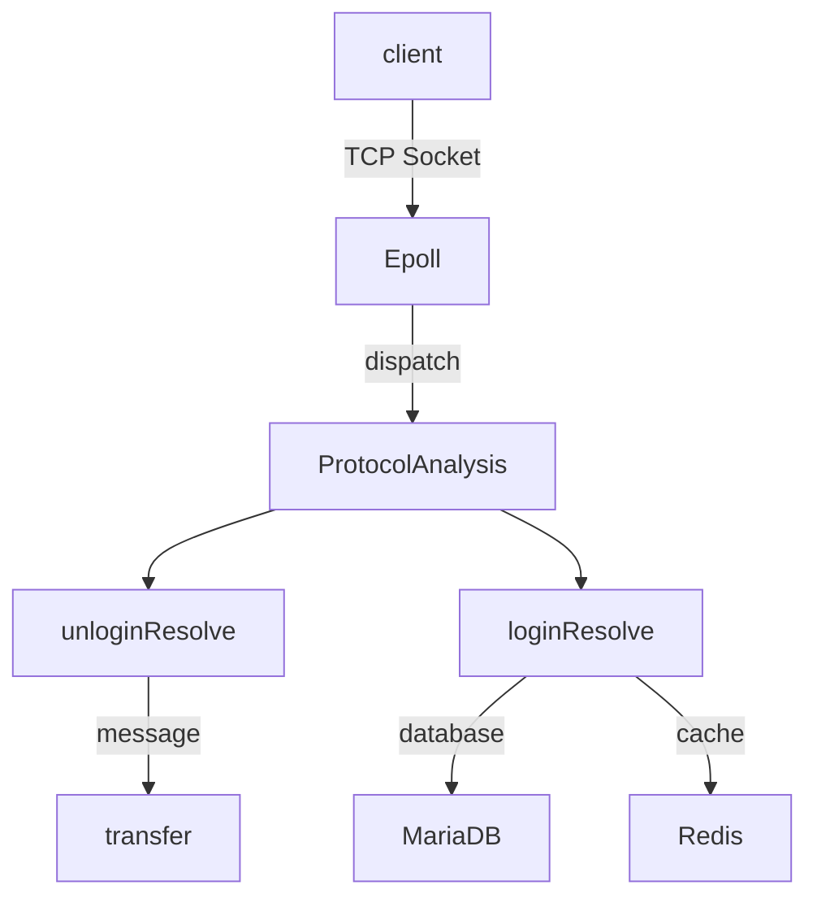

# <div align="center"><b><a href="README.md">简体中文</a> | <a href="README_EN.md">English</a></b></div>

# Violet 🚀

[](https://en.cppreference.com/)
[](https://en.cppreference.com/)

## introduction
        High Concurrency：Epoll ET + Thread Pool

        share_memory: shared_ptr + atomic

        MariaDB Connection Pool 

        Redis 

## compile
```bash
git clone https://github.com/witnesswish/Violet.git
cd Violet && mkdir build && cd build
cmake .. && make -j4
./Violet
```
I am using hiredis and mariadb/conncpp, you need to install them before compiling
If you need to test functions, write your code on test.cpp and use the following command， all command below are based on build directory
```
cmake -DBUILD_TEST=ON .. && make test
```


# 架构



✉️ 联系：violet@elveso.asia | [博客文章](https://elveso.asia/blog/)

