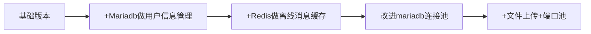
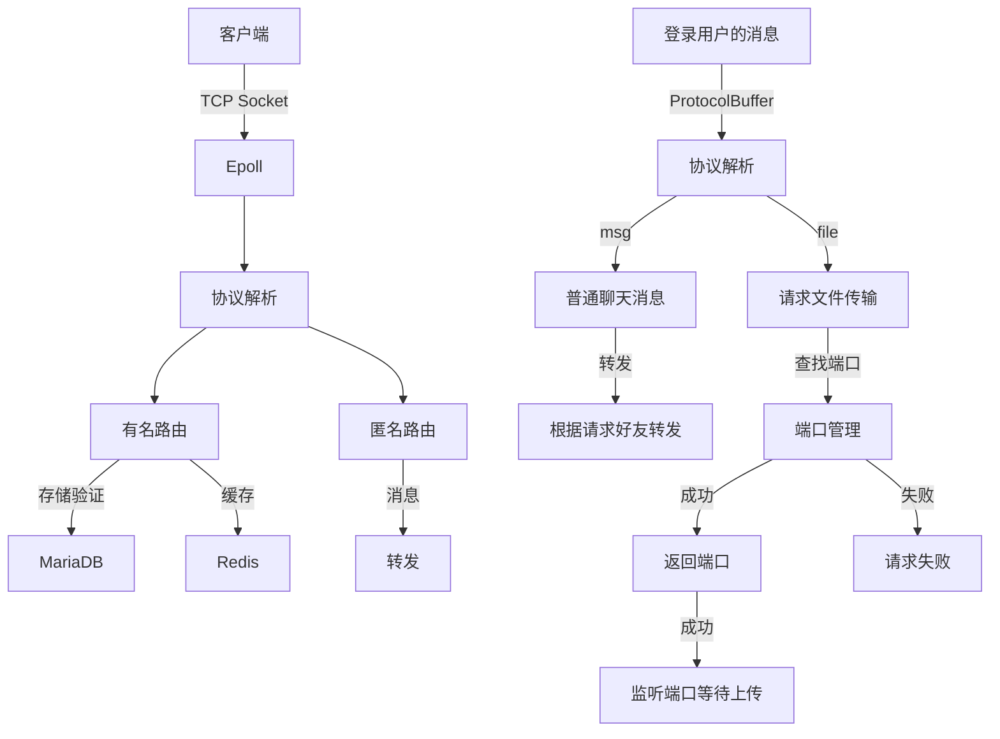

# <div align="center"><b><a href="README.md">简体中文</a> | <a href="README_EN.md">English</a></b></div>

# Violet 🚀


[](https://en.cppreference.com/)
[](https://en.cppreference.com/)

**工业级C++后端项目** | Reactor模型 · 双存储引擎 · mariadb连接池

## 简介
        高性能架构：基于Epoll ET模式+线程池，单机支持8000+并发连接

        零依赖部署：纯C++实现，无需容器化，make一键编译运行

        智能指针内存管理

        MariaDB连接池

        Redis 做离线消息缓存

        Reactor网络模型 

## 编译
```bash
git clone https://github.com/witnesswish/Violet.git
cd Violet && mkdir build && cd build
cmake .. && make -j4
./Violet
```
服务端使用了 hiredis 和 mariadb/conncpp, 编译前需要安装这两个库
需要进行模块测试，请修改test.cpp后参考以下命令，下面的所有命令都是基于build目录下运行：
```
cmake -DBUILD_TEST=ON .. && make test
```


# 架构
版本演化：




✉️ 联系：violet@elveso.asia | [博客文章](https://elveso.asia/blog/)

