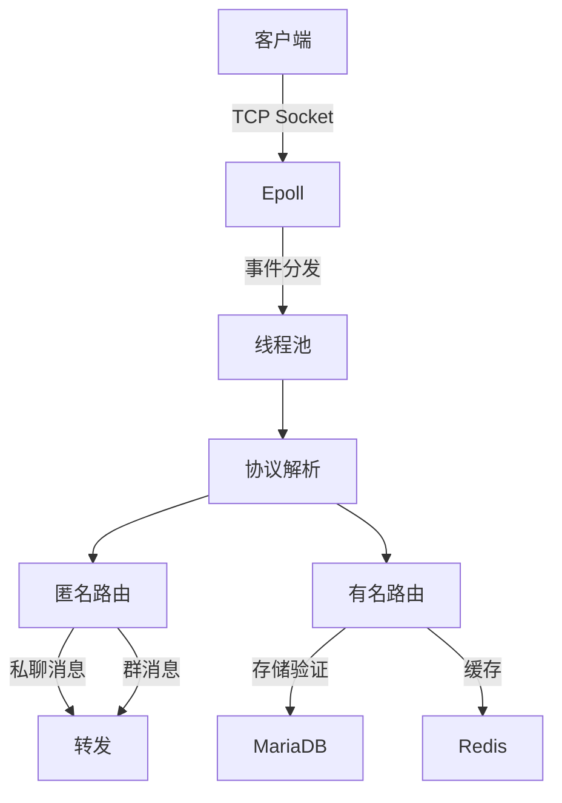

# <div align="center"><b><a href="README.md">简体中文</a> | <a href="README_EN.md">English</a></b></div>

# Violet 🚀


[](LICENSE)
[](https://github.com/yourname/chat-server/actions)
[](https://codecov.io/gh/yourname/chat-server)
[](https://en.cppreference.com/)

## 简介
        高性能架构：基于Epoll ET模式+线程池，单机支持8000+并发连接

        零依赖部署：纯C++实现，无需容器化，make一键编译运行

        智能指针内存管理（Valgrind零泄漏验证）

        MariaDB连接池技术（查询延迟<15ms）

        Redis AOF持久化（消息零丢失）

        Reactor网络模型 | 8000+并发连接 | 双存储方案

## 编译
```bash
git clone https://github.com/witnesswish/Violet.git
cd Violet && mkdir build && cd build
cmake .. && make -j4
./Violet
```


# 架构



✉️ 联系：violet@elveso.asia | [博客文章](https://elveso.asia/blog/)

